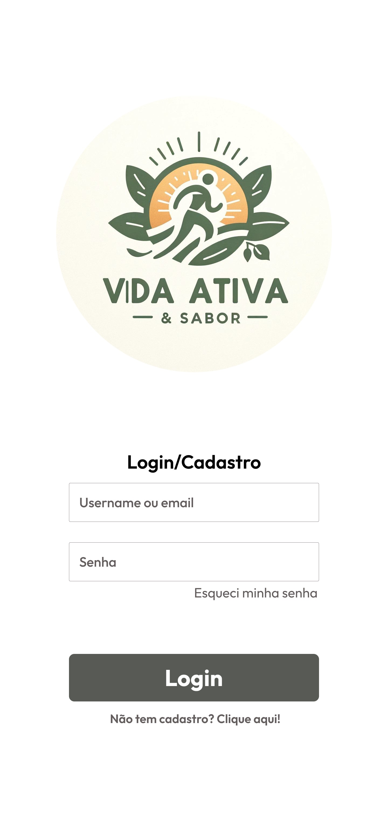

# 
**Vida Ativa & Sabor**

---

Giulia Fernandes Donato de Mattos, 

Isadora Aparecida Cardoso Carvalho, 

Raphael Lucas Oliveira dos Santos, 

Ricardo de Andrade,

Rômulo Ferraz Chaves. 

---

### Instituto de Informática e Ciências Exatas – Pontifícia Universidade Católica de Minas Gerais (PUC MINAS) 
### Belo Horizonte – MG – Brasil

gfdmattos@sga.pucminas.br 

iaccarvalho@sga.pucminas.br 

raphaellucasoliveira557@gmail.com 

ricardo.andrade.1140351@sga.pucminas.br

romulochavesferraz@gmail.com 

---

## 1. INTRODUÇÃO

&nbsp;&nbsp;&nbsp;&nbsp;A alimentação desempenha um papel crucial na promoção da saúde e no bem-estar humano. No Brasil, as primeiras medidas voltadas para alimentação e nutrição surgiram a partir da segunda metade da década de 1930. Em 1940, foi criado o Serviço de Alimentação da Previdência Social (SAPS) com o objetivo de tornar as refeições acessíveis aos trabalhadores (Fogagnoli, 2013).

&nbsp;&nbsp;&nbsp;&nbsp;Para ilustrar a importância dos recursos disponíveis, uma citação do Boletim Mensal do SAPS apresenta uma analogia entre construir uma casa apenas com materiais simples e construir uma casa com materiais de melhor qualidade. Isso sugere que a qualidade dos recursos disponíveis influencia diretamente na solidez e durabilidade da estrutura, assim como na qualidade da alimentação e na saúde do indivíduo. 

&nbsp;&nbsp;&nbsp;&nbsp;É relevante diferenciar entre simplesmente "comer" e "alimentar-se", onde apenas comer seria ingerir comida sem se preocupar com sua origem, ingredientes e valores nutricionais, o que deixaria o indivíduo vulnerável a carências nutricionais e doenças. Essa distinção destaca a importância de uma alimentação consciente e nutritiva para a saúde e bem-estar. 

&nbsp;&nbsp;&nbsp;&nbsp;Segundo a Pesquisa Nacional de Saúde (PNS, 2020), mais da metade dos adultos no Brasil apresentam excesso de peso, o que representa 60,3% da população adulta, totalizando 96 milhões de pessoas. Além disso, estudos indicam que mais de 19 mil mortes por infarto e AVC são atribuídas ao consumo de produtos ultraprocessados por ano no Brasil (Nilson, 2020). Esses dados evidenciam a urgência de abordar a questão da alimentação saudável, uma vez que negligenciar esse aspecto pode resultar em adversidades na qualidade e expectativa de vida.

&nbsp;&nbsp;&nbsp;&nbsp;Este trabalho visa explorar a importância de uma alimentação saudável na promoção da saúde, abordando não apenas os aspectos físicos, mas também os impactos psicológicos e sociais. Antes de apresentar a problemática a ser investigada, é fundamental contextualizar a área de pesquisa do trabalho, apresentando conceitos e dados relacionados.

**1.1 Problema**

&nbsp;&nbsp;&nbsp;&nbsp;Apesar da conscientização crescente sobre alimentação saudável, muitas pessoas enfrentam desafios para adotar e manter hábitos alimentares saudáveis, incluindo falta de informação adequada, dificuldade em encontrar opções saudáveis, adesão limitada a restrições dietéticas, falta de acompanhamento e suporte, e impacto socioeconômico. É crucial superar esses obstáculos para facilitar a adoção de hábitos alimentares saudáveis e promover uma vida mais saudável e equilibrada.

**1.2 Objetivos do trabalho**

&nbsp;&nbsp;&nbsp;&nbsp;Este projeto tem como objetivo criar um site dedicado à promoção de hábitos alimentares saudáveis, fornecendo aos usuários receitas nutritivas e dicas para alcançar seus objetivos de saúde e fitness. Os objetivos específicos incluem: 

&nbsp;&nbsp;&nbsp;&nbsp;Desenvolver uma plataforma interativa para que os usuários possam acessar informações sobre hábitos alimentares saudáveis, incluindo receitas balanceadas para ganho de massa muscular, perda de gordura e promoção da saúde geral. 

&nbsp;&nbsp;&nbsp;&nbsp;Oferecer uma ampla variedade de receitas saudáveis, adaptadas às necessidades individuais dos usuários, levando em consideração restrições dietéticas, preferências alimentares e metas pessoais. 

&nbsp;&nbsp;&nbsp;&nbsp;Integrar ferramentas de planejamento de refeições que permitam aos usuários criarem planos alimentares personalizados, com base em suas preferências e objetivos específicos de saúde e fitness. 

&nbsp;&nbsp;&nbsp;&nbsp;Implementar recursos de acompanhamento de progresso, como registros de consumo alimentar e exercícios físicos, para que os usuários possam monitorar seu desempenho e fazer ajustes conforme necessário. 

&nbsp;&nbsp;&nbsp;&nbsp;Facilitar a interação entre os usuários, permitindo que compartilhem experiências, dicas e receitas por meio de fóruns de discussão e sistemas de comentários. 

&nbsp;&nbsp;&nbsp;&nbsp;Fornecer informações educacionais sobre nutrição, saúde e condicionamento físico, com o objetivo de capacitar os usuários a fazerem escolhas alimentares mais conscientes e adotar um estilo de vida mais saudável a longo prazo. 

&nbsp;&nbsp;&nbsp;&nbsp;Esses objetivos visam criar uma plataforma abrangente e acessível que ajude os usuários a alcançarem seus objetivos de saúde e bem-estar, promovendo hábitos alimentares saudáveis e um estilo de vida ativo. 

**1.3. Justificativa**

&nbsp;&nbsp;&nbsp;&nbsp;Desenvolver uma aplicação dedicada à promoção de hábitos alimentares saudáveis, fornecendo aos usuários receitas nutritivas e dicas para alcançar seus objetivos de saúde e fitness é motivado por uma série de fatores essenciais.  

&nbsp;&nbsp;&nbsp;&nbsp;A motivação para trabalhar com esta aplicação específica está enraizada na crescente conscientização sobre a importância da alimentação saudável e do exercício físico para o bem-estar geral. Portanto, é crucial oferecer aos usuários uma plataforma que facilite e promova a adoção desses hábitos saudáveis. Reconhecendo que as necessidades dietéticas e os objetivos de fitness variam de pessoa para pessoa, é fundamental disponibilizar uma ampla variedade de opções adaptadas a diferentes restrições nutricionais, preferências alimentares e metas individuais. Isso não apenas aumenta a relevância do aplicativo para um público mais diversificado, mas também melhora a probabilidade de adesão e sucesso dos usuários em seus objetivos de saúde. 

&nbsp;&nbsp;&nbsp;&nbsp;Além disso, é essencial incluir ferramentas de planejamento de refeições e acompanhamento de progresso para oferecer aos usuários uma abordagem estruturada na busca de suas metas. Estas funcionalidades não só ajudam a manter o foco e a motivação ao longo do tempo, mas também capacitam os usuários a tomarem decisões alimentares mais conscientes. A educação sobre nutrição, saúde e condicionamento físico desempenha um papel fundamental nesse processo, permitindo que os usuários desenvolvam uma compreensão mais profunda dos princípios relacionados e adotem um estilo de vida saudável a longo prazo.  

&nbsp;&nbsp;&nbsp;&nbsp;Ao aprofundar esses aspectos no desenvolvimento do software, o objetivo é criar uma plataforma abrangente que não apenas forneça recursos práticos, mas também promova uma mudança positiva no comportamento e no estilo de vida dos usuários. Dessa forma, contribuiremos para uma sociedade mais saudável e ativa. 

**1.4. Público-alvo**

&nbsp;&nbsp;&nbsp;&nbsp;O sistema proposto tem como objetivo alcançar pessoas com o desejo de manter uma vida saudável sem renunciar ao sabor nas refeições de forma caseira, trazendo tanto receitas de fácil preparo quanto as mais elaboradas. O conceito do projeto contém o poder de levar pessoas a aderir a esse estilo de vida, uma vez que um dos maiores impeditivos para isso é exatamente a restrição alimentícia.

---

## 2. ESTADO DA ARTE

&nbsp;&nbsp;&nbsp;&nbsp;Alimentação Saudável: Um Estado da Arte. 

&nbsp;&nbsp;&nbsp;&nbsp;A crescente preocupação na sociedade contemporânea com uma alimentação saudável despertou a atenção de pesquisadores em uma abordagem abrangente. Neste estado da arte, exploraremos os aspectos positivos e negativos associados à alimentação, sublinhando a importância de manter uma relação equilibrada com os alimentos. 

&nbsp;&nbsp;&nbsp;&nbsp;A pressão social e os padrões estéticos, conforme evidenciado por Perloff, R. M. (2014), podem conduzir a uma obsessão pelo peso ideal, resultando em dietas extremas e comportamentos prejudiciais à saúde. A ditadura da balança é um fenômeno alimentado por ideais inatingíveis, que muitas vezes levam a consequências adversas. 

&nbsp;&nbsp;&nbsp;&nbsp;Transtornos alimentares, como bulimia e anorexia nervosa, conforme estudado por Smolak, L., & Murnen, S. K. (2008), são manifestações desses padrões estéticos, afetando não apenas a saúde física, mas também a saúde mental. Fardouly, J., Diedrichs, P. C., Vartanian, L. R., & Halliwell, E. (2015), aprofunda a influência da sociedade na alimentação e imagem corporal, destacando a pressão social como um fator contribuinte para distúrbios alimentares. 

&nbsp;&nbsp;&nbsp;&nbsp;No entanto, a busca por uma alimentação saudável não está isenta de aspectos positivos. Mozaffarian, D., Benjamin, E. J., Go, A. S., Arnett, D. K., Blaha, M. J., Cushman, M., ... & Turner, M. B. (2016), ressaltam que adotar uma alimentação equilibrada contribui não apenas para a prevenção de doenças, mas também fortalece o sistema imunológico e promove o bem-estar geral. Além disso, escolhas alimentares conscientes, como discutido por Tilman, D., & Clark, M. (2014), estão intrinsicamente ligadas à sustentabilidade ambiental, incentivando práticas que reduzem o impacto negativo no meio ambiente. 

&nbsp;&nbsp;&nbsp;&nbsp;As pesquisas atuais revelam um cenário complexo, onde benefícios e desafios coexistem. Divergências entre pesquisadores são evidentes nos efeitos da pressão social, enquanto convergem na importância da promoção da saúde. As lacunas incluem a necessidade de explorar mais profundamente a relação entre indústria alimentícia e escolhas alimentares, bem como os impactos psicológicos a longo prazo de uma alimentação equilibrada. 

&nbsp;&nbsp;&nbsp;&nbsp;Em conclusão, compreender a complexidade dessas questões é crucial para promover uma abordagem equilibrada em relação à alimentação. Reconhecendo os desafios enfrentados pela sociedade moderna, visamos garantir não apenas a saúde física, mas também o bem-estar psicológico, destacando a necessidade de uma pesquisa contínua e aprofundada para abordar as lacunas existentes. 

---

## 3. DOCUMENTO DE ESPECIFICAÇÃO DE REQUISITOS DE SOFTWARE

**3.1 Objetivos deste documento** 

&nbsp;&nbsp;&nbsp;&nbsp;Descrever e especificar as necessidades dos usuários que devem ser atendidas pelo projeto Vida Ativa e Sabor que utilizará um sistema de gestão de receitas. 

**3.2 Escopo do produto** 

**3.2.1 Nome do produto e seus componentes principais**

&nbsp;&nbsp;&nbsp;&nbsp;O produto será um sistema de gestão de receitas e exercícios físicos, chamado "Vida Ativa e Sabor" e composto por único módulo centralizado, ou seja, todas as funcionalidades serão integradas em um só sistema. 

**3.2.2 Missão do produto**

&nbsp;&nbsp;&nbsp;&nbsp;Fornece uma plataforma colaborativa para compartilhamento de receitas culinárias com foco na alimentação saudável e prática de atividade física. 

**3.2.3 Limites do produto**

&nbsp;&nbsp;&nbsp;&nbsp;O sistema não fornecerá acompanhamento médico e/ou nutricional e verificar origem dos ingredientes. 

**3.2.4 Benefícios do produto**
<!--Benefícios do produto-->
| # | Benefício                                                   | Valor para o Cliente
|---|-------------------------------------------------------------|----------------------|
| 1 | Facilidade no acesso às receitas                            | Essencial 
| 2 | Facilidade no compartilhamento de receitas                  | Essencial 
| 3 | Facilidade no acesso às recomendações de atividades físicas | Essencial 
| 4 | Facilidade no cadastro de usuários                          | Essencial 
| 5 | Facilidade na consulta de receitas                          | Essencial 

 

**3.3 Descrição geral do produto**

**3.3.1 Requisitos Funcionais**
| Código | Funcionalidade                                              | Descrição
|--------|-------------------------------------------------------------|-------------|
| RF1 | Biblioteca das Minhas Receitas                                 | Conjunto de receitas escolhidas pelo usuário 
| RF2 | Busca de receitas                                              | Filtrar por pesquisa uma receita desejada
| RF3 | Gerenciar perfil de usuário                                    | Criação, edição e exclusão de usuários. 
| RF4 | Gerenciar dicas de exercícios físicos                          | Processamento de Inclusão, Alteração, Exclusão e Consulta de receitas 
| RF5 | Gerenciar as receitas                                          | Processamento de Inclusão, Alteração, Exclusão e Consulta de receitas
| RF6 | Biblioteca de exercícios físicos                               | Conjunto de exercícios físicos escolhidos pelo usuário
| RF7 | Comentário                                                     | Permitir que o usuário envie suas dúvidas e sugestões em comentários 
| RF8 | Entrar no Sistema                                              | Permitir que o usuário seja capaz de se “logar” ao sistema 
| RF9 | Sair do Sistema                                                | Permitir que o usuário possa se “deslogar”  

 

**3.3.1 Requisitos Não Funcionais**
| Código | Funcionalidade                                   | Descrição
|--------|--------------------------------------------------|-------------|
| RF1 | Desempenho                                          | O sistema deve ser capaz de lidar com o número necessário de usuários sem degradar o seu desempenho.
| RF2 | Usabilidade                                         | O sistema deve ser fácil de se usar e se entender. 
| RF3 | Gerenciar perfil de usuário                         | O sistema deve ter ao menos uma validação no ato de login.  
| ... | ...                                                 | ... 

**3.3.2 Usuários**
| # | Ator                                   | Definição
|---|--------------------------------------------------|-------------|
| 1 | Usuário Comum                                    | Usuário responsável pelo cadastro parcial de receitas e cadastro de suas próprias informações no perfil 
| 2 | Administrador                                    | Usuário responsável pelo cadastro parcial de receitas e pelo gerenciamento geral do sistema
| 3 | Profissional Ed. Física                          | Usuário responsável pelo cadastro de exercícios físicos   

 

**3.4 Modelagem do Sistema**

**3.4.1 Diagrama de Casos de Uso**

&nbsp;&nbsp;&nbsp;&nbsp;Como pode ser visto no diagrama de casos de uso, os usuários comuns têm uma ampla gama de interações com o sistema, desde o acesso inicial ao sistema até o gerenciamento de seus perfis e consultoria para receitas culinárias. Eles também podem ajustar receitas, marcar como favoritas e gerenciar comentários na página do fórum.  

&nbsp;&nbsp;&nbsp;&nbsp;Os usuários administradores, por outro lado, possuem funcionalidades estendidas, incluindo o gerenciamento de usuários do sistema e o gerenciamento de receitas publicadas.  

&nbsp;&nbsp;&nbsp;&nbsp;Além disso, tanto usuários regulares quanto administradores podem gerenciar aspectos personalizados do sistema, como treinos e rotinas semanais de exercícios com base em preferências pessoais. 

Figura 1: Diagrama de Casos de Uso do Sistema

&nbsp;&nbsp;&nbsp;&nbsp;3.4.2 Descrições de Casos de Uso 

| 
Entrar no Sistema (CSU01)
 |
|-------------------------------------------------------------------------------------------------------------------------------------------------------------------------|
| Sumário: O usuário realiza o acesso ao sistema. |
| Ator Primário: Usuário comum, Administrador e Profissional de Educação Física. |
| Ator Secundário: Não possui. |
| Pré-condições: O usuário deve estar cadastrado no sistema. |
| Fluxo Principal: |
| 1. O usuário informa o usuário de login e senha. |
| 2. O Sistema realiza a validação da senha informada. |
| 3. Se o Usuário informou a senha errada o sistema apresenta mensagem de erro “Senha Incorreta” e o caso de uso retorna ao passo 1; caso contrário o caso de uso termina |
| Pós-condições: O usuário entra no sistema e tem acesso às suas informações e funcionalidades. |

| 
Gerencia suas dicas de exercícios (CSU02)
 |
|-------------------------------------------------------------------------------------------------------------------------------------------------------------------------|
| Sumário: O profissional de educação física realiza o gerenciamento dos exercícios físicos. |
| Ator Primário: Profissional de Educação Física. |
| Ator Secundário: Não possui. |
| Pré-condições: O profissional deve estar cadastrado no sistema. |
| Fluxo Principal: |
| 1. O usuário define seus interesses e informa os exercícios relacionados. |
| 2. O Sistema apresenta as dicas de exercício. |
| Fluxo Alternativo: |
| 3. O usuário pode responder os comentários dos usuários em um fórum aberto, sobre suas dicas. |
| Pós-condições: Um comentário foi inserido ou removido, seus dados serão alterados ou apresentados na tela. |

| 
Gerenciar Perfil de Usuário (CSU03)
 |
|-------------------------------------------------------------------------------------------------------------------------------------------------------------------------|
| Sumário: O usuário realiza o gerenciamento do seu cadastro no site. |
| Ator Primário: Usuário comum, Administrador e Profissional de Educação Física. |
| Ator Secundário: Não possui. |
| Pré-condições: O usuário deve estar cadastrado no sistema. |
| Fluxo Principal: |
| 1. O usuário consegue alterar seus dados cadastrados. |
| 2. O usuário consegue excluir o seu registro.  |
| Pós-condições: Um dado foi inserido ou removido, seus valores foram alterados ou apresentados na tela. |

| 
Gerenciar Usuários (CSU04)
 |
|-------------------------------------------------------------------------------------------------------------------------------------------------------------------------|
| Sumário: O usuário Administrador gerencia os usuários do sistema. |
| Ator Primário: Administrador. |
| Ator Secundário: Não possui. |
| Pré-condições: O usuário deve estar cadastrado no sistema. |
| Fluxo Principal: |
| 1.  O Sistema apresenta as operações que podem ser realizadas: a inclusão de um usuário, a alteração de um usuário, a busca de um usuário e o bloqueio. |
| Fluxo Alternativo (1): Inclusão  |
| 1. O administrador requisita a inclusão de um usuário. |
| 2. O sistema solicita os dados para a inclusão do usuário | 
| Fluxo Alternativo (2): Alteração |
| 1. O administrador solicita a alteração dos dados de alteração no sistema.  |
| 2. O sistema verifica os dados informados e os válida, caso esteja de acordo com as necessidades o usuário é alterado. | 
| Fluxo Alternativo (3): Exclusão |
| 1. O usuário Administrador consegue realizar a exclusão de acesso ao sistema de um usuário. |
| 2. O sistema realiza a exclusão do usuário. | 
| Pós-condições: Um usuário comum foi inserido, alterado ou excluído, seus dados serão alterados ou apresentados na tela. |

| 
Gerenciar Receitas (CSU05) 
 |
|-------------------------------------------------------------------------------------------------------------------------------------------------------------------------|
| Sumário: O usuário criador, ou administrador é capaz de gerenciar as receitas publicadas.  |
| Ator Primário: Usuário. |
| Ator Secundário: Usuário administrador. |
| Pré-condições: O usuário deve estar cadastrado no sistema. |
| Fluxo Principal: |
| 1.   O Sistema apresenta as operações que podem ser realizadas: a inclusão, a alteração, busca e remoção de uma receita. |
| Fluxo Alternativo (1): Inclusão  |
| 1. O usuário solicita a inclusão de uma receita nova. |
| 2. O sistema solicita os dados para a inclusão da receita. | 
| 3. O usuário fornece os dados solicitados. |
| 4. O sistema verifica os dados enviados e gera a receita. |
| Fluxo Alternativo (2): Alteração |
| 1. O usuário solicita a alteração dos dados no sistema. |
| 2. O sistema verifica os dados informados, caso esteja de acordo com as necessidades a receita é alterada. |
| Fluxo Alternativo (3): Exclusão |
| 1. O usuário consegue realizar a solicitação de remoção de uma receita. |
| 2. O sistema realiza a remoção dela. | 
| Pós-condições: Uma receita foi inserida, alterada ou removida, seus dados foram alterados ou apresentados na tela. |

| 
Busca de Receitas (CSU06) 
 |
|-------------------------------------------------------------------------------------------------------------------------------------------------------------------------|
| Sumário: O usuário comum realiza a consulta de uma receita culinária cadastrada no sistema. |
| Ator Primário: Usuário comum. |
| Ator Secundário: Não possui. |
| Pré-condições: Usuário comum. |
| Fluxo Principal: |
| 1. O usuário comum requisita a consulta de uma receita culinária cadastrada no sistema |
| 2. O Sistema apresenta as operações de busca de receita por palavra que conste no título da receita. |
| 3. O usuário comum seleciona a Consulta, ou opta por finalizar o caso de uso. |
| 4. Se o usuário comum desejar continuar com a consulta de receita, o caso de uso retorna ao passo 2; caso contrário, o caso de uso termina. |
| Pós-condições:  Uma receita foi consultada, seus dados foram apresentados na tela. |

| 
 Gerencia sua biblioteca de treinos (CSU07) 
 |
|-------------------------------------------------------------------------------------------------------------------------------------------------------------------------|
| Sumário: O usuário realiza o gerenciamento de sua biblioteca de treino. |
| Ator Primário: Usuário comum. |
| Ator Secundário: Não possui. |
| Pré-condições: O usuário deve estar cadastrado no sistema. |
| Fluxo Principal: |
| 1. O sistema apresenta as operações que irão ser realizadas: Inclusão e exclusão. |
| Fluxo Alternativo (1): Inclusão |
| 1. O usuário solicita a inclusão de novo exercício em sua biblioteca. |
| 2. O sistema a adiciona. |
| Fluxo Alternativo (2): Exclusão |
| 1. O usuário solicita a exclusão de um exercício de sua biblioteca |
| 2. O sistema realiza a exclusão dele. | 
| Pós-condições: Um exercício foi inserido ou removido, seus dados foram alterados ou apresentados na tela. |

| 
 Gerenciar Biblioteca de “Minhas Receitas” (CSU08) 
 |
|-------------------------------------------------------------------------------------------------------------------------------------------------------------------------|
| Sumário: O usuário comum gerencia sua biblioteca de receitas. |
| Ator Primário: Usuário comum. |
| Ator Secundário: Não possui. |
| Pré-condições: O usuário deve estar cadastrado no sistema. |
| Fluxo Principal: |
| 1. O sistema apresenta as operações que irão ser realizadas: Inclusão e exclusão. |
| Fluxo Alternativo (1): Inclusão |
| 1. O usuário solicita a inclusão de nova receita em sua biblioteca. |
| 2. O sistema a adiciona. |
| Fluxo Alternativo (2): Exclusão |
| 1. O usuário solicita a exclusão de uma receita de sua biblioteca.  |
| 2. O sistema realiza a exclusão dela. | 
| Pós-condições: Uma receita foi inserida ou alterada, seus dados foram apresentados, ou alterados na tela. |

| 
 Gerenciar Comentários (CSU9) 
 |
|-------------------------------------------------------------------------------------------------------------------------------------------------------------------------|
| Sumário: O usuário comum é capaz de gerenciar seus comentários de dúvidas e sugestões.  |
| Ator Primário: Usuário comum. |
| Ator Secundário: Não possui. |
| Pré-condições: O usuário deve estar cadastrado no sistema. |
| Fluxo Principal: |
| 1. O Sistema apresenta as operações que podem ser realizadas: a inclusão e remoção de um comentário. |
| Fluxo Alternativo (1): Inclusão |
| 1. O usuário realiza a inclusão de um comentário. |
| 2. O sistema publica o comentário. |
| Fluxo Alternativo (2): Exclusão |
| 1. O usuário consegue realizar a solicitação de remoção de um comentário. |
| 2. O sistema realiza a remoção dele. | 
| Pós-condições: Um comentário foi inserido ou removido, seus dados foram apresentados ou removidos na tela. |

| 
 Sair do Sistema (CSU10) 
 |
|-------------------------------------------------------------------------------------------------------------------------------------------------------------------------|
| Sumário: O usuário sai do sistema.  |
| Ator Primário: Usuário comum, Administrador ou Profissional de Educação Física. |
| Ator Secundário: Não possui. |
| Pré-condições: O usuário deve estar cadastrado no sistema. |
| Fluxo Principal: |
| 1. O usuário acessa a função de saída. |
| 2. O Sistema realiza o deslogue da conta. |
| Pós-condições: O usuário Saiu do sistema. |

**3.4.3 Diagrama de Classes**

&nbsp;&nbsp;&nbsp;&nbsp;A Figura 2 mostra o diagrama de classes do sistema. A Matrícula deve conter a identificação do funcionário responsável pelo registro, bem com os dados do aluno e turmas. Para uma disciplina podemos ter diversas turmas, mas apenas um professor responsável por ela. 

 Figura 2: Diagrama de Classes do Sistema. 

**3.4.3 Diagrama de Classes**
| # | Nome                                   | Descrição
|---|----------------------------------------|-------------|
| 1 | Usuário                                | Gerencia as informações de usuários do sistema, incluindo autenticação e identificação, como login, e-mail, nome e senha. Armazena também se o usuário é administrador ou educador físico.
| 2 | BibliotecaReceita                      | Representa um conjunto de receitas disponíveis no sistema. Contém operações para adicionar, remover e consultar receitas. 
| 3 | BibliotecaExercício                    | Representa um conjunto de receitas disponíveis no sistema. Contém operações para adicionar, remover e consultar receitas.  
| 4 | ItemBibliotecaReceita                  | Representa um item individual dentro da biblioteca de receitas. Associado a uma receita específica e gerencia o cadastro e manutenção desta receita na biblioteca. 
| 5 | ItemBibliotecaExercício                | Representa um item individual dentro da biblioteca de exercícios. Associado a um exercício específico e gerencia o cadastro e manutenção deste exercício na biblioteca. 
| 6 | Receita                                | Detalha a estrutura de uma receita, com título, modo de preparo, tempo de preparo, porções e foto. Permite operações para adicionar, editar, remover e consultar uma receita. 
| 7 | Exercício                              | Detalha a estrutura de um exercício, com título, duração, dificuldade, foto e descrição. Permite operações para adicionar, editar, remover e consultar um exercício. 
| 8 | Comentário                             | Permite adicionar comentários aos exercícios, contendo o texto do comentário. Permite operações para adicionar e remover um comentário. 

---

## 4. PROJETO DO DESIGN DE INTERAÇÃO

**4.1. Personas**

&nbsp;&nbsp;&nbsp;&nbsp;4.1.1 Rodrigo Pimentel:

&nbsp;&nbsp;&nbsp;&nbsp;4.1.2 Ana Luiza Maia:

&nbsp;&nbsp;&nbsp;&nbsp;4.1.3 Luciana Azevedo:

&nbsp;&nbsp;&nbsp;&nbsp;4.1.4 Luiz Silva:

&nbsp;&nbsp;&nbsp;&nbsp;4.1.5 Murilo Bonfim:

**4.2. Mapa da Empatia**

&nbsp;&nbsp;&nbsp;&nbsp;4.2.1 Rodrigo Pimentel:

&nbsp;&nbsp;&nbsp;&nbsp;4.2.2 Ana Luiza Maia:

&nbsp;&nbsp;&nbsp;&nbsp;4.2.3 Luciana Azevedo:

&nbsp;&nbsp;&nbsp;&nbsp;4.2.4 Luiz Silva:

&nbsp;&nbsp;&nbsp;&nbsp;4.2.5 Murilo Bonfim:

**4.3 Protótipos das Interfaces** 

&nbsp;&nbsp;&nbsp;&nbsp;4.3.1 Tela inicial: 

&nbsp;&nbsp;&nbsp;&nbsp;4.3.2 Tela de “confirmar a exclusão”: 

&nbsp;&nbsp;&nbsp;&nbsp;4.3.3 Tela “biblioteca de exercícios”: 

&nbsp;&nbsp;&nbsp;&nbsp;4.3.4 Tela “biblioteca de receitas”: 

&nbsp;&nbsp;&nbsp;&nbsp;4.3.5 Tela “receitas específicas”:

&nbsp;&nbsp;&nbsp;&nbsp;4.3.6 Tela “exercício específico”:

&nbsp;&nbsp;&nbsp;&nbsp;4.3.7 Tela “cadastro de exercício”:

&nbsp;&nbsp;&nbsp;&nbsp;4.3.8 Tela “cadastro de receitas”:

&nbsp;&nbsp;&nbsp;&nbsp;4.3.9 Tela "login”:

&nbsp;&nbsp;&nbsp;&nbsp;4.3.10 Tela “cadastro de usuário”:

&nbsp;&nbsp;&nbsp;&nbsp;4.3.11 Tela “página do usuário”: 

 

**Página Principal com Receitas e Exercícios:** 

&nbsp;&nbsp;&nbsp;&nbsp;A página principal apresenta duas seções principais: "Receitas Saudáveis" e "Exercícios Físicos", onde:
- Receitas Saudáveis: nesta seção contém uma série de imagens de pratos saudáveis e uma breve descrição que incentiva o usuário a explorar as receitas. Há um carrossel de imagens mostrando diferentes pratos e um botão "Ver Mais" que direciona o usuário para mais receitas. 
- Exercícios Físicos: similar à seção de receitas, esta parte da página mostra várias imagens de pessoas praticando exercícios físicos. A descrição convida o usuário a explorar diferentes rotinas de exercícios. Também possui um carrossel de imagens e um botão "Ver Mais" para acessar mais conteúdos sobre exercícios.
&nbsp;&nbsp;&nbsp;&nbsp;A navegação principal inclui um logotipo da marca, um campo de busca e links para entrar ou se cadastrar.

&nbsp;&nbsp;&nbsp;&nbsp;Os princípios gestálticos da página são:
- Proximidade: as seções de "Receitas Saudáveis" e "Exercícios Físicos" estão bem definidas e os elementos dentro de cada seção são agrupados próximos uns dos outros. Isso facilita a percepção de que pertencem a categorias diferentes, ajudando o usuário a distinguir claramente entre os dois tipos de conteúdo. 
- Boa continuidade (alinhamento): a estrutura linear e alinhada das seções facilita a navegação e a leitura contínua. As linhas de texto e as imagens estão organizadas de forma que o olhar do usuário seja guiado de maneira natural pela página. 
- Simetria: as imagens e os textos são dispostos de maneira simétrica dentro de cada seção, proporcionando um equilíbrio visual que torna a interface agradável e fácil de usar. 
- Similaridade: o uso consistente de imagens e estilos de texto nas seções de receitas e exercícios cria uma identidade visual coesa, ajudando os usuários a reconhecerem padrões e entender a estrutura da página rapidamente. 
- Fecho: a disposição dos elementos permite que o usuário complete mentalmente os espaços vazios, percebendo a interface como completa e organizada. Isso é visível na forma como os textos e as imagens estão posicionados para criar uma sensação de totalidade. 
- Região comum: cada seção está dentro de uma região claramente delimitada, o que facilita a percepção de que os elementos dentro dessas regiões pertencem ao mesmo grupo e são parte de uma mesma categoria. 
&nbsp;&nbsp;&nbsp;&nbsp;Quanto a Oito Regras de Ouro da página, são: 
- Perseguir a Consistência: o layout mantém um estilo consistente em termos de cores, fontes e disposição de elementos entre as seções de receitas e exercícios. Isso facilita a navegação e reduz a carga cognitiva dos usuários. 
- Fornecer Feedbacks Informativos: os botões "Ver Mais" fornecem feedback visual claro, indicando ao usuário que há mais conteúdo disponível para visualização. 
- Marcar o Final dos Diálogos: os botões de "Ver Mais" sinalizam a conclusão da visualização inicial, oferecendo uma transição clara para mais informações. 
- Fornecer Controle de Iniciativa do Usuário: o usuário tem controle sobre o que deseja visualizar em mais detalhes, podendo clicar nos botões para explorar mais receitas ou exercícios. 
- Reduzir a Carga de Memória de Trabalho: as informações essenciais são apresentadas diretamente na interface, evitando que o usuário precise lembrar de detalhes de outras páginas para entender o conteúdo atual.

 

**Página de Biblioteca de Receitas:**

&nbsp;&nbsp;&nbsp;&nbsp;Esta tela exibe uma grade organizada de receitas saudáveis, cada uma representada por um cartão contendo:  
- Uma imagem do prato. 
- O nome da receita ("Salada Tropical"). 
- Uma lista de ingredientes com marcadores, detalhando os componentes do prato, como "Alface Americana", "Manga em cubos", "Cebola roxa", "Pepino", "Tomate em cubos" e "Limão". 
&nbsp;&nbsp;&nbsp;&nbsp;Cada cartão de receita é uniformemente estilizado, facilitando a navegação visual e permitindo ao usuário comparar diferentes receitas rapidamente. A interface é limpa e organizada, com cada elemento bem delimitado e claramente associado à receita correspondente.

&nbsp;&nbsp;&nbsp;&nbsp;Os princípios gestálticos da página são:  
- Proximidade: ingredientes e informações de cada receita estão próximos uns dos outros, agrupando-os como uma unidade. Isso facilita a percepção de que esses elementos estão relacionados e pertencem à mesma receita. 
- Boa continuidade (alinhamento): a grade alinhada das receitas facilita a navegação visual e a leitura contínua, guiando o olhar do usuário de maneira ordenada através dos elementos. 
- Simetria: cada cartão de receita é simétrico, com imagens e textos dispostos de maneira equilibrada. Isso cria uma sensação de ordem e organização. 
- Similaridade: os cartões de receitas têm um layout e estilo visual semelhantes, criando consistência visual que ajuda os usuários a reconhecer rapidamente cada item como uma receita. 
- Região comum: cada receita está dentro de um cartão delimitado, indicando que os elementos dentro desse cartão pertencem ao mesmo grupo e são parte da mesma receita.

&nbsp;&nbsp;&nbsp;&nbsp;Quanto a Oito Regras de Ouro da página, são:  
- Perseguir a Consistência: os cartões de receita mantêm um layout e estilo visual consistentes, ajudando a criar uma interface uniforme e fácil de usar. 
- Fornecer Feedbacks Informativos: cada cartão de receita fornece informações claras sobre os ingredientes e o nome da receita, facilitando a compreensão imediata. 
- Marcar o Final dos Diálogos: a visualização das receitas está bem delimitada dentro dos cartões, indicando claramente o início e o fim da seção de informações. 
- Fornecer Controle de Iniciativa do Usuário: o usuário pode escolher qual receita deseja visualizar em mais detalhes, proporcionando uma experiência interativa. 
- Reduzir a Carga de Memória de Trabalho: as informações essenciais sobre cada receita são apresentadas diretamente no cartão, evitando que o usuário precise lembrar de detalhes adicionais para entender o conteúdo.

 

**Página de Receitas Específicas:** 

&nbsp;&nbsp;&nbsp;&nbsp;Esta interface exibe de forma organizada todas as informações necessárias para o preparo da receita exibida na tela. Ela é composta pelo título da receita, sua foto, seu rendimento, tempo de preparo, ingredientes e modo de fazer, além de um botão para a avalição dos usuários. A tela é limpa e organizada, com cada elemento bem delimitado e claramente associado à receita correspondente. 
&nbsp;&nbsp;&nbsp;&nbsp;Os princípios gestálticos da página são:
- Proximidade: ingredientes estão próximos uns dos outros, agrupando-os como uma unidade, isso facilita a percepção de que esses elementos estão relacionados e pertencem ao mesmo tópico. A mesma coisa acontece com o modo de preparo e suas etapas. 
- Boa continuidade (alinhamento): a grade alinhada dos componentes da receita facilita a navegação visual e a leitura contínua, guiando o olhar do usuário de maneira ordenada através dos elementos. 
- Simetria: os textos e foto estão dispostos de maneira equilibrada, ocupando quantidade semelhante de espaço nos lados direito e esquerdo da tela. Isso cria uma sensação de ordem e organização. 
- Similaridade: os componentes, como ingredientes e modo de preparo da receita têm um layout e estilo visual semelhantes, criando consistência visual que ajuda os usuários a reconhecer rapidamente cada item como pertencente daquela receita.

&nbsp;&nbsp;&nbsp;&nbsp;Quanto a Oito Regras de Ouro da página, são:  
- Perseguir a Consistência: as informações da receita mantêm um layout e estilo visual consistentes, ajudando a criar uma interface uniforme e fácil de usar. 
- Fornecer Feedbacks Informativos: a interface fornece informações claras sobre o nome da receita, rendimento, tempo de preparo, ingredientes e modo de fazer, facilitando a compreensão imediata. 
- Fornecer Controle de Iniciativa do Usuário: o usuário pode escolher se deseja ou não avaliar a receita e em caso positivo, ele pode escolher a pontuação de acordo com seu grau de satisfação, proporcionando uma experiência interativa. 
- Reduzir a Carga de Memória de Trabalho: as informações essenciais sobre a receita são apresentadas diretamente, evitando que o usuário precise lembrar de detalhes adicionais para entender o conteúdo. 

 

**Tela Cadastro de Receitas:**

&nbsp;&nbsp;&nbsp;&nbsp;A interface apresentada é uma página de cadastro de receitas do sistema "Vida Ativa & Sabor". O formulário de cadastro inclui campos para título, rendimento, ingredientes e modo de preparo. Há botões para inserir, alterar ou excluir receita e abaixo uma tabela interativa com a lista de receitas que o usuário pode escolher para fazer as mudanças desejadas. Na parte inferior, estão os links para política de privacidade, central de privacidade, termos de uso e redes sociais. 

&nbsp;&nbsp;&nbsp;&nbsp;Princípios Gestálticos:
- Proximidade: Os campos do formulário são agrupados de maneira lógica, com os campos posicionados próximos uns dos outros. 
- Similaridade: Uso consistente de estilos para os campos de entrada e botões, facilitando a identificação e interação. 
- Continuidade: A disposição dos campos de entrada segue uma sequência lógica de cima para baixo. 
- Unidade: A interface mantém um design coeso, com uma paleta de cores harmoniosa e elementos bem alinhados.

&nbsp;&nbsp;&nbsp;&nbsp;Recomendações Ergonômicas:
- Tamanho Adequado dos Campos: Campos de entrada são suficientemente grandes para fácil leitura e interação. 
- Contraste: Bom contraste entre texto e fundo (ex: texto preto em fundo branco) para garantir legibilidade. 
- Espaçamento: Espaçamento adequado entre os campos para evitar sobrecarga visual e facilitar a interação. 
- Botão Visível: Os botões são destacados em cores que chamam a atenção, facilitando a localização pelo usuário. 

&nbsp;&nbsp;&nbsp;&nbsp;Regras de Design 

&nbsp;&nbsp;&nbsp;&nbsp;As 8 regras de ouro de Shneiderman foram seguidas da seguinte forma:
- Consistência: Uso consistente de cores, fontes e layouts em toda a interface. 
- Feedback Informativo: Cada campo de entrada oferece feedback visual quando está ativo. 
- Prevenção de erros: Possibilidade de corrigir informações antes de enviar. 
- Controle do Usuário: o design permite que o usuário escolha entre inserir, alterar ou excluir receita. 
- Redução de Memória: o design é simples e direto e mostra todas as informações necessárias, reduzindo a necessidade do usuário memorizar informações.

 

**Página de Login:**

&nbsp;&nbsp;&nbsp;&nbsp;A tela de login serve como o ponto de entrada para usuários em uma aplicação ou sistema e desempenha funções importantes, como: autenticação, segurança, personalização, acesso a funcionalidades e recuperação de conta. 
&nbsp;&nbsp;&nbsp;&nbsp;Os princípios gestálticos da página são: 
- Proximidade: os campos de "Username" e "Senha" estão próximos, indicando que ambos são parte do processo de login. 
- Semelhança: há consistência de fonte, que é a “Outfit” e estilo entre os campos e botões reforça a ideia de um conjunto coeso. 
- Continuidade: há um fluxo natural de cima para baixo guiando o usuário. 
- Fechamento: as caixas de entrada e botões estão claramente delineados dando a percepção de completude. 
- Figura-fundo: está destacado os campos de entrada e botões, pois está em contraste com o fundo. 
- Simplicidade: o design da tela de login está simples e limpo.

&nbsp;&nbsp;&nbsp;&nbsp;Quanto a Oito Regras de Ouro da página, são: 
- Consistência: uso uniforme de cores (tons de verde e laranja) e fontes em toda a interface. 
- Atalhos: não há necessidade nessa página, porém está presente "Esqueci minha senha", facilitando a recuperação de senha sem necessidade de navegação adicional. 
- Feedback informativo: o botão de login deixa claro a informação é para o usuário acessar o sistema. 
- Controle do Usuário: o design permite que o usuário escolha entre fazer login ou se cadastrar. 
- Redução de Memória: o design é simples e direto, reduzindo a necessidade de o usuário memorizar informações.

 

**Página de Confirmação:**

&nbsp;&nbsp;&nbsp;&nbsp;O modal de confirmação é uma janela pop-up simples e centralizada que aparece quando o usuário tenta excluir uma receita.  
- Mensagem: a mensagem na modal pergunta ao usuário se ele realmente deseja excluir a receita "Salada Tropical", proporcionando clareza sobre a ação a ser confirmada. 
- Botões de Ação: há dois botões no modal, "Não" e "Sim", permitindo que o usuário cancele ou confirme a exclusão da receita. Os botões são claramente rotulados e estilizados de forma consistente com o resto da interface. 
&nbsp;&nbsp;&nbsp;&nbsp;O modal também inclui um ícone de fechar ("X") no canto superior direito, permitindo que o usuário feche a janela sem tomar nenhuma ação.

&nbsp;&nbsp;&nbsp;&nbsp;Os princípios gestálticos da página são:
- Proximidade: o texto de confirmação e os botões "Sim" e "Não" estão próximos, indicando claramente que estão relacionados e fazem parte da mesma ação. 
- Boa continuidade (alinhamento): os elementos no modal estão alinhados de maneira que guiam o olhar do usuário de cima para baixo, facilitando a leitura e a compreensão da mensagem. 
- Simetria: o modal é simétrico, com os botões "Sim" e "Não" dispostos de maneira equilibrada, o que torna a interface visualmente agradável e fácil de entender. 
- Similaridade: os botões "Sim" e "Não" têm estilos visuais semelhantes, indicando que são opções relacionadas e proporcionando uma experiência de usuário consistente. 
- Fecho: o modal é delimitado por uma borda clara, ajudando o usuário a perceber o contorno completo e o contexto da ação que está sendo confirmada. 
- Região comum: todos os elementos dentro do modal estão em uma região confinada, indicando claramente que pertencem ao mesmo contexto de ação e facilitando a compreensão do que está sendo solicitado. 

&nbsp;&nbsp;&nbsp;&nbsp;Quanto a Oito Regras de Ouro da página, são:  
- Perseguir a Consistência: o estilo do modal é consistente com o resto da interface, mantendo a uniformidade visual. 
- Fornecer Feedbacks Informativos: o modal fornece feedback claro sobre a ação de exclusão, perguntando ao usuário se deseja confirmar a ação, o que é essencial para evitar erros. 
- Marcar o Final dos Diálogos: a modal marca o final do processo de exclusão ao solicitar confirmação, deixando claro que a ação está pendente de uma decisão final. 
- Fornecer Prevenção de Erros e Forma Simples de Corrigi-los: o modal evita exclusões acidentais ao solicitar confirmação do usuário, prevenindo erros e fornecendo uma maneira simples de corrigir uma ação não intencional. 
- Permitir a Reversão de Ações: o botão "Não" permite ao usuário cancelar a ação de exclusão, oferecendo uma forma fácil de reverter a decisão. 
- Fornecer Controle de Iniciativa do Usuário: o usuário tem controle sobre a confirmação ou cancelamento da ação de exclusão, proporcionando uma experiência de usuário centrada no controle. 
- Reduzir a Carga de Memória de Trabalho: o nome da receita a ser excluída é mostrado no modal, evitando que o usuário precise lembrar dessa informação e facilitando a compreensão da ação. 

 

**Tela Cadastro de Usuário:** 

&nbsp;&nbsp;&nbsp;&nbsp;A interface apresentada é uma página de cadastro de usuário do sistema "Vida Ativa & Sabor". O formulário de cadastro inclui campos para nome, data de nascimento, email, confirmação de email, senha, confirmação de senha e telefone. Há um botão destacado de "Cadastrar" e um link para login, caso o usuário já possua uma conta. Na parte inferior, estão os links para política de privacidade, central de privacidade, termos de uso e redes sociais. 

&nbsp;&nbsp;&nbsp;&nbsp;Princípios Gestálticos:
- Proximidade: Os campos do formulário são agrupados de maneira lógica, com campos relacionados (como email e confirmação de email) posicionados próximos uns dos outros. 
- Similaridade: Uso consistente de estilos para os campos de entrada e botões, facilitando a identificação e interação. 
- Continuidade: A disposição dos campos de entrada segue uma sequência lógica de cima para baixo. 
- Unidade: A interface mantém um design coeso, com uma paleta de cores harmoniosa e elementos bem alinhados.

&nbsp;&nbsp;&nbsp;&nbsp;Recomendações Ergonômicas:
- Tamanho Adequado dos Campos: Campos de entrada são suficientemente grandes para fácil leitura e interação. 
- Contraste: Bom contraste entre texto e fundo (ex: texto preto em fundo branco) para garantir legibilidade. 
- Espaçamento: Espaçamento adequado entre os campos para evitar sobrecarga visual e facilitar a interação. 
- Botão Visível: O botão "Cadastrar" é destacado em uma cor que chama a atenção, facilitando a localização pelo usuário.

&nbsp;&nbsp;&nbsp;&nbsp;Regras de Design:

&nbsp;&nbsp;&nbsp;&nbsp;As 8 regras de ouro de Shneiderman foram seguidas da seguinte forma: 
- Consistência: Uso consistente de cores, fontes e layouts em toda a interface. 
- Atalhos: Link para login fornece um caminho rápido para usuários que já possuem uma conta. 
- Feedback Informativo: Cada campo de entrada oferece feedback visual quando está ativo. 
- Fechar Diálogos: Botão "Cadastrar" claramente definido para concluir a ação de cadastro. 
- Prevenção de Erros: Campos de confirmação de email e senha ajudam a evitar erros de digitação. 
- Desfazer Ações: Possibilidade de corrigir informações antes de enviar. 
- Sentimento de Controle: Usuário pode ver todos os campos e informações requeridas de uma vez, sem surpresas. 
- Redução de Carga Cognitiva: Interface limpa e simples, com todas as informações necessárias claramente apresentadas.

 

**Tela de Controle de Usuário:**

&nbsp;&nbsp;&nbsp;&nbsp;A interface apresentada é uma página de usuário do sistema "Vida Ativa & Sabor". 

&nbsp;&nbsp;&nbsp;&nbsp;Ela inclui um formulário com campos para nome, data de nascimento, email, senha e telefone. Há dois botões de ação: "Alterar cadastro" e "Confirmar alterações". A página também exibe o logo da empresa e links para a política de privacidade, central de privacidade, termos de uso, e redes sociais. 
&nbsp;&nbsp;&nbsp;&nbsp;Princípios Gestálticos:
- Proximidade: Os campos do formulário são agrupados de maneira lógica, com campos relacionados posicionados próximos uns dos outros. 
- Similaridade: Uso consistente de estilos para os campos de entrada e botões, facilitando a identificação e interação. 
- Continuidade: A disposição dos campos de entrada segue uma sequência lógica da esquerda para a direita e de cima para baixo. 
- Unidade: A interface mantém um design coeso, com uma paleta de cores harmoniosa e elementos bem alinhados.

&nbsp;&nbsp;&nbsp;&nbsp;Recomendações Ergonômicas
- Tamanho Adequado dos Campos: Campos de entrada são suficientemente grandes para fácil leitura e interação. 
- Contraste: Bom contraste entre texto e fundo (ex: texto preto em fundo branco) para garantir legibilidade. 
- Espaçamento: Espaçamento adequado entre os campos para evitar sobrecarga visual e facilitar a interação. 
- Botões Visíveis: Botões de ação, como "Alterar cadastro" e "Confirmar alterações", são destacados com cores que chamam a atenção.

&nbsp;&nbsp;&nbsp;&nbsp;Regras de Design

&nbsp;&nbsp;&nbsp;&nbsp;As 8 regras de ouro de Shneiderman foram seguidas da seguinte forma: 
- Consistência: Uso consistente de cores, fontes e layouts em toda a interface. 
- Atalhos: Botões de ação proporcionam um caminho rápido para editar e confirmar as informações do usuário. 
- Feedback Informativo: Cada campo de entrada oferece feedback visual quando está ativo. 
- Fechar Diálogos: Botões de ação claramente definidos para concluir as tarefas de alteração e confirmação de cadastro. 
- Prevenção de Erros: Campos de entrada claros e bem definidos ajudam a evitar erros de preenchimento. 
- Desfazer Ações: Possibilidade de corrigir informações antes de confirmar as alterações. 
- Sentimento de Controle: Usuário pode ver todos os campos e informações requeridas de uma vez, sem surpresas. 
- Redução de Carga Cognitiva: Interface limpa e simples, com todas as informações necessárias claramente apresentadas. 
&nbsp;&nbsp;&nbsp;&nbsp;Nesta etapa deve-se dar uma ênfase na implementação do software de modo que possam ser realizados os testes com usuários na etapa seguinte. 

 

**Tela Cadastro de Exercícios**

&nbsp;&nbsp;&nbsp;&nbsp;A interface apresentada é uma página de cadastro de exercícios do sistema "Vida Ativa & Sabor". O formulário de cadastro inclui campos para nome do exercício, passo a passo e envio de arquivos para exemplo. Há botões para inserir, alterar ou excluir exercício e abaixo uma tabela interativa com a lista de exercícios que o usuário pode escolher para fazer as mudanças desejadas. Na parte inferior, estão os links para política de privacidade, central de privacidade, termos de uso e redes sociais. 

&nbsp;&nbsp;&nbsp;&nbsp;Princípios Gestálticos:
- Proximidade: Os campos do formulário são agrupados de maneira lógica, com os campos posicionados próximos uns dos outros. 
- Similaridade: Uso consistente de estilos para os campos de entrada e botões, facilitando a identificação e interação. 
- Continuidade: A disposição dos campos de entrada segue uma sequência lógica de cima para baixo. 
- Unidade: A interface mantém um design coeso, com uma paleta de cores harmoniosa e elementos bem alinhados. 

&nbsp;&nbsp;&nbsp;&nbsp;Recomendações Ergonômicas 
- Tamanho Adequado dos Campos: Campos de entrada são suficientemente grandes para fácil leitura e interação. 
- Contraste: Bom contraste entre texto e fundo (ex: texto preto em fundo branco) para garantir legibilidade. 
- Espaçamento: Espaçamento adequado entre os campos para evitar sobrecarga visual e facilitar a interação. 
- Botão Visível: Os botões são destacados em cores que chamam a atenção, facilitando a localização pelo usuário. 

&nbsp;&nbsp;&nbsp;&nbsp;Regras de Design

&nbsp;&nbsp;&nbsp;&nbsp;As 8 regras de ouro de Shneiderman foram seguidas da seguinte forma: 
- Consistência: Uso consistente de cores, fontes e layouts em toda a interface. 
- Feedback Informativo: Cada campo de entrada oferece feedback visual quando está ativo. 
- Prevenção de erros: Possibilidade de corrigir informações antes de enviar. 
- Controle do Usuário: o design permite que o usuário escolha entre inserir, alterar ou excluir exercício. 
- Redução de Memória: o design é simples e direto e mostra todas as informações necessárias, reduzindo a necessidade do usuário memorizar informações. 

 

**Página de Exercício Específico:**

&nbsp;&nbsp;&nbsp;&nbsp;Esta interface exibe de forma organizada todas as informações necessárias para a execução do exercício exibido na tela. Ele é composto pelo título do exercício, sua foto, seu passo a passo e exemplo de como fazer. A tela é limpa e organizada, com cada elemento bem delimitado e claramente associado ao exercício correspondente. 
&nbsp;&nbsp;&nbsp;&nbsp;Os princípios gestálticos da página são:  
- Proximidade: instruções estão próximas umas das outras, agrupando-as como uma unidade, isso facilita a percepção de que esses elementos estão relacionados e pertencem ao mesmo tópico. A mesma coisa acontece com o exemplo logo abaixo.
- Boa continuidade (alinhamento): a grade alinhada dos componentes do passo a passo facilita a navegação visual e a leitura contínua, guiando o olhar do usuário de maneira ordenada através dos elementos. 
- Simetria: os textos e foto estão dispostos de maneira equilibrada, ocupando quantidade semelhante de espaço nos lados direito e esquerdo da tela. Isso cria uma sensação de ordem e organização. 
- Similaridade: os componentes, como instruções e exemplo de execução do exercício têm um layout e estilo visual semelhantes, criando consistência visual que ajuda os usuários a reconhecer rapidamente cada item como pertencente daquele exercício. 
- Região comum: tanto o guia de passo a passo quanto os exemplos de execução estão confinados em uma única região especial confinada para maior percepção do grupo de instruções.

&nbsp;&nbsp;&nbsp;&nbsp;Quanto a Oito Regras de Ouro da página, são:   
- Perseguir a Consistência: as informações do exercício mantêm um layout e estilo visual consistentes, ajudando a criar uma interface uniforme e fácil de usar. 
- Fornecer Feedbacks Informativos: a interface fornece informações claras sobre o nome do exercício, passo a passo e modo de fazer, facilitando a compreensão imediata. 
- Fornecer Controle de Iniciativa do Usuário: o usuário pode escolher se deseja ou não permanecer na página do exercício. 
- Reduzir a Carga de Memória de Trabalho: as informações essenciais sobre a exercício são apresentadas diretamente, evitando que o usuário precise lembrar de detalhes adicionais para entender o conteúdo. 

---

## 5. Plano de Testes de Software
<ol>
<li><a href="Documentos/Avaliação_Heurística.xlsx">Planilha de avaliação heurística</a></li>
<li><a href="Documentos/Relatórios dos Testes com Usuários">Relatório de Testes com Usuário</a></li>
</ol>

---

## Referências

&nbsp;&nbsp;&nbsp;&nbsp;FOGAGNOLI, M. . A arte da boa alimentação: o projeto de educação alimentar de nutricionistas e nutrólogos e o Serviço de Alimentação da Previdência Social - SAPS (1940-1960). In: XXVII Simpósio Nacional de História - Conhecimento histórico e diálogo social, 2013, Natal. Anais do XXVII Simpósio Nacional de História, 2013. 

&nbsp;&nbsp;&nbsp;&nbsp;A Influência dos Sistemas Alimentares nos Hábitos Alimentares. Observatório Brasileiro de Hábitos Alimentares. Disponível em: https://obha.fiocruz.br/?p=1413. Acesso em: 27/02/2024. 

&nbsp;&nbsp;&nbsp;&nbsp;Perloff, R. M. (2014). Social media effects on young women’s body image concerns: Theoretical perspectives and an agenda for research. Sex Roles, 71(11-12), 363-377. 
&nbsp;&nbsp;&nbsp;&nbsp;Transtornos alimentares e sua relação com a imagem corporal. 
&nbsp;&nbsp;&nbsp;&nbsp;Acesso em: 27/02/2024. 

&nbsp;&nbsp;&nbsp;&nbsp;Smolak, L., & Murnen, S. K. (2008). Drive for leanness: Assessment and relationship to gender, gender role stereotyping, and objectification. Body image, 5(3), 251-260. 
&nbsp;&nbsp;&nbsp;&nbsp;Influência da sociedade na alimentação e imagem corporal. 
&nbsp;&nbsp;&nbsp;&nbsp;Acesso em: 27/02/2024. 

&nbsp;&nbsp;&nbsp;&nbsp;Fardouly, J., Diedrichs, P. C., Vartanian, L. R., & Halliwell, E. (2015). Social comparisons on social media: the impact of Facebook on young women's body image concerns and mood. Body image, 13, 38-45. 
&nbsp;&nbsp;&nbsp;&nbsp;Impacto da alimentação saudável na saúde cardiovascular. 
&nbsp;&nbsp;&nbsp;&nbsp;Acesso em: 27/02/2024. 

&nbsp;&nbsp;&nbsp;&nbsp;Mozaffarian, D., Benjamin, E. J., Go, A. S., Arnett, D. K., Blaha, M. J., Cushman, M., ... & Turner, M. B. (2016). Executive summary: heart disease and stroke statistics—2016 update: a report from the American Heart Association. Circulation, 133(4), 447-454. 
&nbsp;&nbsp;&nbsp;&nbsp;Alimentação saudável e sustentabilidade: uma abordagem integrada. 
&nbsp;&nbsp;&nbsp;&nbsp;Acesso em: 27/02/2024. 

 &nbsp;&nbsp;&nbsp;&nbsp;Tilman, D., & Clark, M. (2014). Global diets link environmental sustainability and human health. Nature. 
&nbsp;&nbsp;&nbsp;&nbsp;Acesso em: 27/02/2024.

